

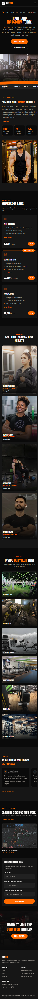

# 🏋️ BodyTech Gym & Fitness Center — Website

A bold, single-page Next.js website built for **BodyTech Gym & Fitness Center**, a real gym in Gulgasht Colony, Multan with an active Google Business profile but no website of its own — built and deployed as a fully working, production-style web app.

<p>
  
  
  
  
  
</p>

<p>
  <a href="https://bodytech-gym-nextjs.vercel.app/">
    
  </a>
  
  
  
</p>

---

## 🔗 Live Demo

**[https://bodytech-gym-nextjs.vercel.app/](https://bodytech-gym-nextjs.vercel.app/)**

The site is deployed on Vercel, indexed on Google (searchable via `site:bodytech-gym-nextjs.vercel.app`), and passes Google's Rich Results Test with valid structured data.

## 📸 Preview

Screenshots taken across desktop, tablet, and mobile breakpoints:

| Desktop | Tablet | Mobile |
|---------|--------|--------|
|  |  |  |

---

## ✨ Features

- **Single-page layout with 9 sections** — Hero, About, Membership Plans, Trainers, Gallery, Reviews, Schedule, Contact, and a closing CTA banner, all on one smooth-scrolling page
- **Fully responsive** — dedicated layouts for mobile, tablet, and desktop breakpoints
- **Bold, high-energy UI** — black/orange fitness-brand theme with a custom scrolling ticker strip and expandable content sections
- **All content served via APIs, not hardcoded** — plans, trainers, gallery captions, reviews, and the class schedule are fetched client-side from dedicated API routes, so updating content only means editing a route file
- **Accurate real-world business data** — address, phone number, opening hours, star rating, and review content all match BodyTech Gym's real Google Business profile; reviews are paraphrased from real member feedback rather than invented
- **Google Rich Results ready** — valid JSON-LD structured data (`ExerciseGym` schema) verified with [Google's Rich Results Test](https://search.google.com/test/rich-results)
- **SEO-configured and indexed** — `robots.txt` and `sitemap.xml` are auto-generated, the site is verified in Google Search Console, and the sitemap has been submitted and crawled
- **Working trial-booking form** — sends a pre-filled email via `mailto:`, with no backend email service or credentials required
- **Expandable content** — "View more" / "View details" interactions for plans, trainer bios, and reviews, keeping the page clean without extra pages

## 🛠️ Tech Stack

| Layer      | Technology                          |
|------------|--------------------------------------|
| Framework  | [Next.js 14](https://nextjs.org/) (App Router) |
| UI Library | [React 18](https://react.dev/)       |
| Styling    | [Tailwind CSS](https://tailwindcss.com/) |
| Language   | JavaScript (ES2022)                  |
| Deployment | [Vercel](https://vercel.com/)        |
| SEO        | Next.js metadata routes (`robots.js`, `sitemap.js`) + JSON-LD structured data |

## 🔌 API Routes

All page content is served through these routes instead of being hardcoded in components:

| Route                  | Method | Returns                                  |
|-------------------------|--------|--------------------------------------------|
| `/api/plans`            | GET    | Membership plan data                       |
| `/api/trainers`         | GET    | Trainer profiles                           |
| `/api/gallery`          | GET    | Gallery photo captions                     |
| `/api/reviews`          | GET    | Member reviews                             |
| `/api/schedule`         | GET    | Weekly class schedule + real business hours |
| `/api/trial-booking`    | POST   | Logs a trial booking locally (development) |

## 📁 Project Structure

```
bodytech-gym/
├── app/
│   ├── api/
│   │   ├── plans/route.js
│   │   ├── trainers/route.js
│   │   ├── gallery/route.js
│   │   ├── reviews/route.js
│   │   ├── schedule/route.js
│   │   └── trial-booking/route.js
│   ├── components/            # One component per section
│   ├── globals.css
│   ├── layout.js               # Includes JSON-LD structured data + Google verification
│   ├── page.js
│   ├── robots.js                # Auto-generates robots.txt
│   └── sitemap.js               # Auto-generates sitemap.xml
├── public/
│   ├── images/                  # Replace with real gym photos — see below
│   └── google[...].html         # Google Search Console verification file
├── data/
│   └── trial-bookings.json      # Local dev log of trial requests
├── screenshots/                 # Desktop/tablet/mobile previews for this README
└── README.md
```

## 🚀 Getting Started

```bash
# 1. Clone the repo
git clone https://github.com/asmashahzadi764-alt/bodytech-gym-nextjs.git
cd bodytech-gym-nextjs

# 2. Install dependencies
npm install

# 3. Run the dev server
npm run dev
```

Open [http://localhost:3000](http://localhost:3000) to view it.

## ⚙️ Configuration

Trial bookings are sent via a `mailto:` link — no environment variables or
email service credentials needed. To set the receiving email, open
`app/components/ScheduleContact.js` and update:

```js
const GYM_CONTACT_EMAIL = "your-email@gmail.com";
```

## 🖼️ Adding Real Photos

All images live in `public/images/`. Replace the placeholder files with real
photos using the **same file names**:

| File                                 | Used for                     |
|---------------------------------------|-------------------------------|
| `logo.png`                            | Navbar logo                   |
| `hero-main.jpg`                       | Hero section photo            |
| `about-trainer.jpg`                   | About section photo           |
| `cta-banner.jpg`                      | Closing CTA background        |
| `gallery-1.jpg` … `gallery-6.jpg`     | Gallery grid (6 photos)       |
| `trainer-1.jpg` … `trainer-4.jpg`     | Trainer profile photos        |

## 🔍 SEO & Search Console

This project was built and verified end-to-end for search visibility, not just deployed:

1. **Structured data** — `app/layout.js` includes a JSON-LD `ExerciseGym` schema block with the gym's real name, address, geo-coordinates, phone number, opening hours, and aggregate rating.
2. **Rich Results validated** — tested against [Google's Rich Results Test](https://search.google.com/test/rich-results), which returned all fields as valid.
3. **Crawling configured** — `app/robots.js` and `app/sitemap.js` generate a live `robots.txt` and `sitemap.xml` at build time.
4. **Search Console verified** — ownership of the deployed domain was verified using a Google-provided HTML verification file, served from `public/`.
5. **Sitemap submitted** — the generated sitemap was submitted through Search Console and successfully crawled.
6. **Indexed** — the site is confirmed indexed and discoverable via `site:bodytech-gym-nextjs.vercel.app` on Google Search.

## 📚 About This Project

Built to practice shipping a complete, real-world web app end to end: choosing a real business with a Google Business profile but no website, designing it, building it with Next.js using AI-assisted code generation, and taking it all the way through deployment, structured data, and search engine indexing — not just running locally.

## 👩‍💻 Author

**Asma Shahzadi**

